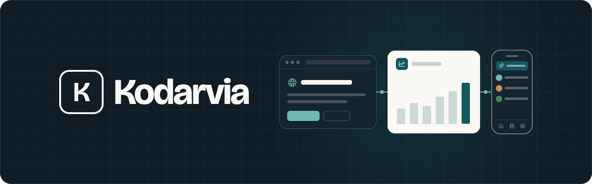
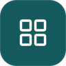
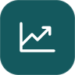
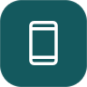
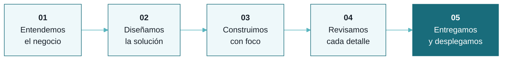
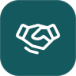
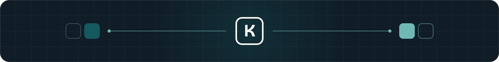

<!-- Cabecera -->

  

<h3 align="center">Software a medida para negocios de Latinoamérica</h3>

  <picture>
    <source media="(prefers-color-scheme: dark)" srcset="https://readme-typing-svg.demolab.com?font=Bricolage+Grotesque&weight=600&size=22&duration=3000&pause=900&color=59B5BF&center=true&vCenter=true&width=620&lines=Webs+que+convierten;Apps+que+ordenan+tu+negocio;CRM+hechos+a+tu+medida;Inteligencia+artificial+que+trabaja+por+vos" />
    
  </picture>

  
  

 

> **Cada negocio tiene un problema que ningún software genérico termina de resolver.**
> En Kodarvia construimos ese software: pensado para cómo trabaja cada empresa, entregado rápido y listo para usarse desde el primer día.

 

## Qué construimos

<table>
  <tr>
    <td width="33%" valign="top">
      
      <h3>Webs y landings</h3>
      Presencia digital que explica, convence y convierte. Rápidas, cuidadas y pensadas para vender.
    </td>
    <td width="33%" valign="top">
      
      <h3>Apps de gestión</h3>
      Reservas, seguimiento, inventario, equipos. Herramientas que ordenan el día a día de un negocio.
    </td>
    <td width="33%" valign="top">
      
      <h3>CRM a medida</h3>
      Clientes, oportunidades y ventas en un solo lugar, con el flujo exacto que cada equipo necesita.
    </td>
  </tr>
  <tr>
    <td width="33%" valign="top">
      
      <h3>Herramientas con IA</h3>
      Asistentes, automatizaciones y análisis que ahorran horas de trabajo repetitivo.
    </td>
    <td width="33%" valign="top">
      
      <h3>Portales y dashboards</h3>
      Datos claros para decidir mejor, con accesos por rol y una experiencia simple.
    </td>
    <td width="33%" valign="top">
      
      <h3>Apps web y PWA</h3>
      Aplicaciones que funcionan en cualquier dispositivo, instalables y sin fricción.
    </td>
  </tr>
</table>

 

## Cómo trabajamos

Cada proyecto parte de un problema real y de un briefing claro. Lo construimos con herramientas modernas, lo revisamos antes de darlo por bueno y nos encargamos de ponerlo en producción.

 

## Lo que nos define

<table>
  <tr>
    <td width="50%" valign="top">
      
      <h4>Velocidad con criterio</h4>
      Iteramos rápido, pero nada sale sin revisión.
    </td>
    <td width="50%" valign="top">
      
      <h4>Software que se usa</h4>
      Diseño simple, pensado para quien lo va a usar todos los días.
    </td>
  </tr>
  <tr>
    <td width="50%" valign="top">
      
      <h4>Confidencialidad</h4>
      Los datos y proyectos de cada cliente se tratan con total reserva.
    </td>
    <td width="50%" valign="top">
      
      <h4>Un solo interlocutor</h4>
      El cliente habla con Kodarvia; nosotros coordinamos todo lo demás.
    </td>
  </tr>
</table>

 

## Stack

  
  
  
  
  
  
  

 

---

## Para partners

Si trabajás con nosotros en un encargo, así funcionan las entregas por GitHub:

1. **Compartí tu repositorio** con esta cuenta (`kodarvia`) como colaborador.
2. **Incluí la URL de preview** en la entrega que subís desde el portal.
3. **Esperá la confirmación:** revisamos cada invitación a mano, así que puede tardar un poco en figurar como aceptada.

<b>Tené en cuenta</b>

 

- Si el encargo se entrega en Lovable, sincronizar el repositorio de GitHub es opcional.
- No hace falta que despliegues la versión final: de eso nos encargamos nosotros.
- Todo el trabajo realizado para Kodarvia es confidencial y no puede mostrarse en portafolios, webs ni redes.
- ¿Dudas? Revisá la sección **Ayuda** del portal o escribinos a partners@kodarvia.com.

 

<!-- Pie -->

  

